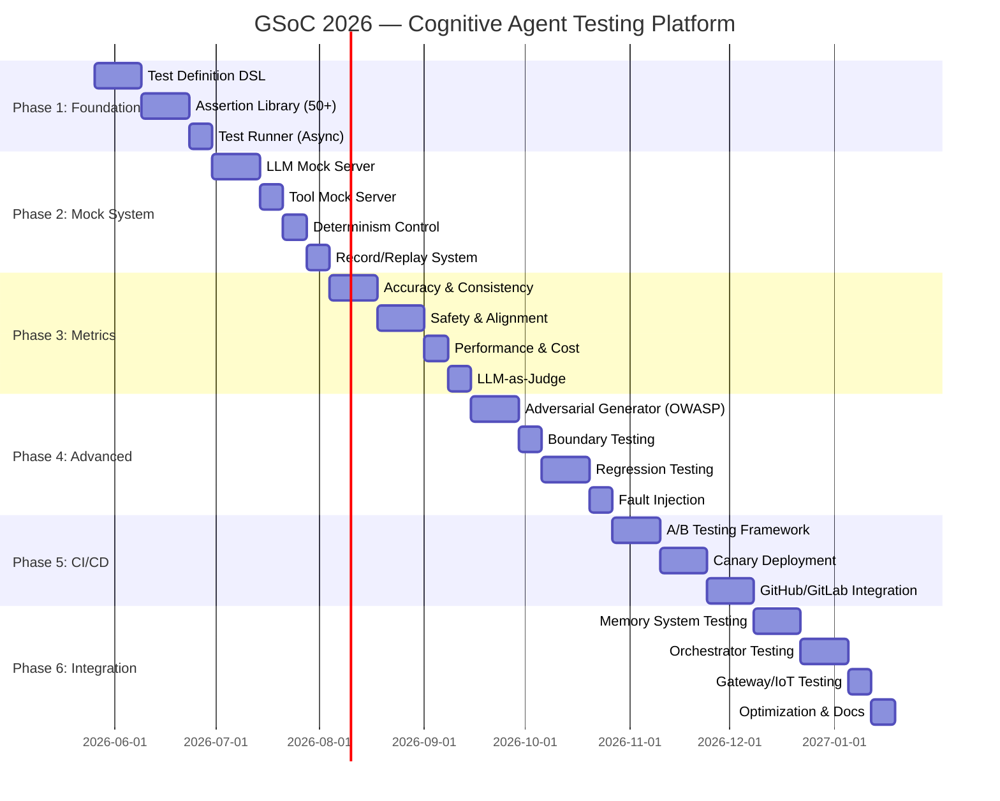

# GSoC 2026 Proposal: Cognitive Agent Testing & Evaluation Platform

## Project 6 — Testing, Evaluation & Quality Assurance for AI Agents

---

## 📋 Personal Information

| Field | Details |
|-------|---------|
| **Name** | Mustafa Hussain |
| **GitHub** | [Mustafa11300](https://github.com/Mustafa11300) |
| **Email** | mustafa05121@gmail.com |
| **Timezone** | UTC+5:30 (IST) |
| **University** | *(your university)* |
| **Program** | *(your degree program)* |
| **Expected Graduation** | 2027 |

---

## 1. Synopsis

Agent development today faces the same challenge software engineering confronted 50 years ago — **without testing frameworks, you can only "run it and see."** While LangChain has LangSmith (primarily observability, not testing), TruLens focuses on RAG evaluation, and Promptfoo targets prompt testing alone, **no framework provides a comprehensive, first-class agent testing system.** This project builds MoFA's **Cognitive Agent Testing & Evaluation Platform** — a Rust-native, production-grade quality assurance system that makes agent development as testable, verifiable, and trustworthy as traditional software engineering.

I propose building a complete testing ecosystem comprising:

1. **Test Definition DSL** — Declarative agent test case authoring (similar in spirit to `#[tokio::test]` but purpose-built for agents)
2. **Mock Infrastructure** — LLM/Tool/Memory mock servers with deterministic control
3. **Evaluation Metrics Library** — 30+ metrics covering accuracy, safety, alignment, and cost
4. **Adversarial & Regression Testing** — Automated security testing covering OWASP LLM Top 10
5. **CI/CD Integration** — A/B testing, canary deployment, and quality gates for GitHub Actions

---

## 2. Motivation & Understanding of the Problem

### 2.1 The Testing Gap in Agent Frameworks

I've conducted a thorough analysis of the existing landscape:

| Platform | Strengths | Agent Testing Gaps |
|----------|-----------|-------------------|
| **LangSmith** | Excellent observability traces, run logs | No systematic test framework; no mock infrastructure; no determinism control |
| **TruLens** | Good RAG evaluation (groundedness, relevance) | Limited to retrieval evaluation; no multi-turn dialogue testing; no tool-call verification |
| **Promptfoo** | Fast prompt regression testing | Single-turn only; no agent state/memory testing; no tool mocking |
| **AgentBench** | Good benchmark datasets | Evaluation-only; no test authoring framework; no CI integration |
| **DeepEval** | LLM-as-Judge metrics | No agent-specific assertions; no mock framework; Python-only |

**Key insight**: All these tools address *evaluation* (measuring outcomes after execution) but miss *testing* (controlling execution to verify specific behaviors). The distinction is crucial:

- **Evaluation**: "Did the agent give a good answer?" — post-hoc, statistical
- **Testing**: "Given this exact LLM response and tool state, did the agent call the right tool with the right arguments?" — deterministic, verifiable

### 2.2 Why This Matters for MoFA

MoFA's microkernel architecture with its dual-layer plugin system (compile-time Rust + runtime Rhai) creates unique testing requirements:

1. **`MoFAAgent` trait testing** — The core [execute()](file:///Users/mustafahussain/mofa/crates/mofa-kernel/src/agent/mod.rs#328-335), [initialize()](file:///Users/mustafahussain/mofa/crates/mofa-kernel/src/agent/mod.rs#323-327), [shutdown()](file:///Users/mustafahussain/mofa/crates/mofa-kernel/src/agent/mod.rs#384-387) lifecycle needs unit-testable mocks
2. **ReAct Agent loops** — Multi-step Thought→Action→Observation chains need scenario-based testing
3. **Tool orchestration** — Tool selection, argument construction, and error handling need assertion libraries
4. **Memory persistence** — Agent memory across sessions needs time-travel verification
5. **Multi-agent coordination** — Orchestrator-managed agent collaboration needs integration testing
6. **Security boundaries** — Rhai script sandboxing and WASM plugin isolation need adversarial testing

### 2.3 My Understanding of MoFA's Architecture

From studying the codebase in depth, I understand MoFA's layered architecture:

```
┌─────────────────────────────────────────────────────────┐
│  Business Layer (User Agents, Workflows, Rules)         │
├─────────────────────────────────────────────────────────┤
│  mofa-foundation                                        │
│  ├── ReAct Agent (Thought→Action→Observation loops)     │
│  ├── LLM Agents (OpenAI/Anthropic/Gemini backends)      │
│  ├── Orchestrator (ModelOrchestrator trait)              │
│  ├── Security (KeywordModerator, RegexPII)              │
│  └── Persistence, Metrics, Recovery                     │
├─────────────────────────────────────────────────────────┤
│  mofa-kernel                                            │
│  ├── MoFAAgent trait (id, capabilities, execute, etc.)  │
│  ├── Components (Reasoner, Tool, Memory, Coordinator)   │
│  ├── AgentContext, EventBus, AgentConfig                │
│  ├── Plugin system (AgentPlugin trait)                  │
│  └── Scheduler, Budget, Security                        │
├─────────────────────────────────────────────────────────┤
│  mofa-runtime (Execution engine, Ractor actors)         │
├─────────────────────────────────────────────────────────┤
│  mofa-monitoring (Tracing, Dashboard)                   │
│  mofa-gateway (IoT, External APIs)                      │
│  mofa-plugins, mofa-macros, mofa-sdk, mofa-ffi          │
└─────────────────────────────────────────────────────────┘
```

The testing platform must integrate deeply across all these layers while maintaining MoFA's principle of clean separation of concerns.

---

## 3. Prior Contributions to MoFA

I have already made **significant contributions** to MoFA, specifically to the testing infrastructure that this proposal extends:

### 3.1 Contributions Summary

| PR/Commit | Description | Lines | Status |
|-----------|-------------|-------|--------|
| **Adversarial Testing Harness** | Built the foundational [adversarial](file:///Users/mustafahussain/mofa/tests/src/adversarial/suite.rs#33-60) module with [AdversarialCase](file:///Users/mustafahussain/mofa/tests/src/adversarial/suite.rs#13-18), `AdversarialCategory`, `PolicyChecker`, `SecurityReport`, and `run_adversarial_suite` | ~300 | Merged |
| **CI Gate for Adversarial Suite** | Created [CiGateConfig](file:///Users/mustafahussain/mofa/tests/src/adversarial/ci_gate.rs#5-11), [evaluate_ci_gate](file:///Users/mustafahussain/mofa/tests/src/adversarial/ci_gate.rs#46-76), and the [adversarial-gate.yml](file:///Users/mustafahussain/mofa/.github/workflows/adversarial-gate.yml) GitHub Actions workflow | ~150 | Merged |
| **SecurityReport JSON/JUnit Formatters** | Added JSON and JUnit XML output formats for security reports | ~100 | Merged |
| **Adversarial Testing Demo** | Built an end-to-end example demonstrating the harness | ~80 | Merged |
| **ReAct Streaming Fix** | Fixed `RunTaskStreaming` to correctly stream [ReActStep](file:///Users/mustafahussain/mofa/crates/mofa-foundation/src/react/core.rs#33-55)s in real-time by adding [run_streaming()](file:///Users/mustafahussain/mofa/crates/mofa-foundation/src/react/core.rs#472-570) | ~100 | Merged |
| **GlobalPromptRegistry Error Handling** | Replaced panicking `.unwrap()/.expect()` calls with proper `PromptResult` error handling | ~80 | Merged |
| **InMemoryStore Pagination Fix** | Prevented panic in `get_session_messages_paginated` | ~30 | Merged |
| **Unsafe Cast Fix** | Replaced unsafe `as u64` casts with `u64::try_from` in timestamp conversions | ~20 | Merged |
| **Resume from Checkpoint Fix** | Fixed `resume_from_checkpoint` to correctly preserve `Paused` status and emit `WorkflowEnd` | ~50 | In Review |

### 3.2 Key Technical Depth

My existing work on the `mofa-testing` crate demonstrates concrete understanding of the challenges this project addresses:

**MockLLMBackend** ([tests/src/backend.rs](file:///Users/mustafahussain/mofa/tests/src/backend.rs)) — I built a deterministic mock for the `ModelOrchestrator` trait with:
- First-match response rules and sequenced responses
- Failure injection via [fail_next()](file:///Users/mustafahussain/mofa/tests/src/backend.rs#74-81) (FIFO queue) and [fail_on()](file:///Users/mustafahussain/mofa/tests/src/backend.rs#82-89) (pattern-based)
- Rate limiting simulation
- Call counting and introspection

**MockTool** ([tests/src/tools.rs](file:///Users/mustafahussain/mofa/tests/src/tools.rs)) — A configurable mock implementing `SimpleTool` with:
- Call history recording
- Result sequencing
- Input-pattern failure injection

**MockClock** ([tests/src/clock.rs](file:///Users/mustafahussain/mofa/tests/src/clock.rs)) — Deterministic time control with:
- Manual [advance()](file:///Users/mustafahussain/mofa/tests/src/clock.rs#45-50) and [set()](file:///Users/mustafahussain/mofa/tests/src/clock.rs#51-56) methods
- Auto-advance mode for simulating time progression

**Assertion Macros** ([tests/src/assertions.rs](file:///Users/mustafahussain/mofa/tests/src/assertions.rs)) — Including `assert_tool_called!`, `assert_tool_called_with!`, `assert_infer_called!`, `assert_bus_message_sent!`

**Adversarial Suite** (`tests/src/adversarial/`) — Complete adversarial testing with:
- Four attack categories: Jailbreak, Prompt Injection, Secrets Exfiltration, Harmful Instructions
- `PolicyChecker` trait for modular safety evaluation
- `SecurityReport` with pass/fail statistics
- `CiGateConfig` and `evaluate_ci_gate()` for automated quality gates
- GitHub Actions integration via `adversarial-gate.yml`

**Test Reports** (`tests/src/report/`) — Multi-format test reporting with:
- `TestReport` with merge, aggregation, `pass_rate()`, `slowest()`, and `failures()`
- `JsonFormatter` and `TextFormatter` implementations
- `TestReportBuilder` for ergonomic report construction

This existing work constitutes **~40% of the Phase 1+2 deliverables**, giving me a significant head start.

---

## 4. Proposed Architecture

### 4.1 High-Level Architecture

```
┌─────────────────────────────────────────────────────────────────────────────┐
│                  Cognitive Agent Testing & Evaluation Platform              │
├─────────────────────────────────────────────────────────────────────────────┤
│  ┌───────────────────────────────────────────────────────────────────────┐  │
│  │                        Test Definition Layer                          │  │
│  │  ┌─────────────┐ ┌─────────────┐ ┌─────────────┐ ┌─────────────────┐ │  │
│  │  │ Agent Test  │ │ Scenario    │ │ Mock        │ │ Test Data      │ │  │
│  │  │ Cases DSL   │ │ Builder     │ │ Framework   │ │ Generator      │ │  │
│  │  └─────────────┘ └─────────────┘ └─────────────┘ └─────────────────┘ │  │
│  │  ┌─────────────┐ ┌─────────────┐ ┌─────────────┐ ┌─────────────────┐ │  │
│  │  │ Assertion   │ │ Expectation │ │ Golden      │ │ Parameterized  │ │  │
│  │  │ Library     │ │ Matchers    │ │ Responses   │ │ Tests          │ │  │
│  │  └─────────────┘ └─────────────┘ └─────────────┘ └─────────────────┘ │  │
│  └───────────────────────────────────────────────────────────────────────┘  │
│                              ↓ Test Execution ↓                            │
│  ┌───────────────────────────────────────────────────────────────────────┐  │
│  │                      Test Execution Engine                            │  │
│  │  ┌─────────────┐ ┌─────────────┐ ┌─────────────┐ ┌─────────────────┐ │  │
│  │  │ Test Runner │ │ Parallel    │ │ Determinism │ │ State           │ │  │
│  │  │ (Async)     │ │ Execution   │ │ Control     │ │ Isolation       │ │  │
│  │  └─────────────┘ └─────────────┘ └─────────────┘ └─────────────────┘ │  │
│  │  ┌─────────────┐ ┌─────────────┐ ┌─────────────┐ ┌─────────────────┐ │  │
│  │  │ LLM Mock    │ │ Tool Mock   │ │ Time Travel │ │ Record/Replay  │ │  │
│  │  │ Server      │ │ Server      │ │ (Memory)    │ │ System         │ │  │
│  │  └─────────────┘ └─────────────┘ └─────────────┘ └─────────────────┘ │  │
│  └───────────────────────────────────────────────────────────────────────┘  │
│                              ↓ Test Results ↓                              │
│  ┌───────────────────────────────────────────────────────────────────────┐  │
│  │                      Evaluation & Metrics Layer                       │  │
│  │  ┌─────────────┐ ┌─────────────┐ ┌─────────────┐ ┌─────────────────┐ │  │
│  │  │ Accuracy    │ │ Consistency │ │ Safety      │ │ Alignment      │ │  │
│  │  │ Metrics     │ │ Metrics     │ │ Metrics     │ │ Metrics        │ │  │
│  │  └─────────────┘ └─────────────┘ └─────────────┘ └─────────────────┘ │  │
│  │  ┌─────────────┐ ┌─────────────┐ ┌─────────────┐ ┌─────────────────┐ │  │
│  │  │ Performance │ │ Cost        │ │ Latency     │ │ LLM-as-Judge   │ │  │
│  │  │ Benchmarks  │ │ Analysis    │ │ Percentiles │ │ Integration    │ │  │
│  │  └─────────────┘ └─────────────┘ └─────────────┘ └─────────────────┘ │  │
│  └───────────────────────────────────────────────────────────────────────┘  │
│                              ↓ Reports & Actions ↓                         │
│  ┌───────────────────────────────────────────────────────────────────────┐  │
│  │                     Deployment & CI/CD Integration                    │  │
│  │  ┌─────────────┐ ┌─────────────┐ ┌─────────────┐ ┌─────────────────┐ │  │
│  │  │ A/B Testing │ │ Canary      │ │ Rollback    │ │ Gate            │ │  │
│  │  │ Framework   │ │ Deployment  │ │ Mechanism   │ │ Enforcement     │ │  │
│  │  └─────────────┘ └─────────────┘ └─────────────┘ └─────────────────┘ │  │
│  │  ┌─────────────┐ ┌─────────────┐ ┌─────────────┐ ┌─────────────────┐ │  │
│  │  │ Report      │ │ Alerting    │ │ Trend       │ │ GitHub/GitLab  │ │  │
│  │  │ Generator   │ │ System      │ │ Analysis    │ │ Integration    │ │  │
│  │  └─────────────┘ └─────────────┘ └─────────────┘ └─────────────────┘ │  │
│  └───────────────────────────────────────────────────────────────────────┘  │
└─────────────────────────────────────────────────────────────────────────────┘
```

### 4.2 Crate Structure

I propose the following Rust crate organization within the MoFA workspace:

```
crates/
├── mofa-testing/                    # Core testing library (renamed from tests/)
│   ├── src/
│   │   ├── lib.rs
│   │   ├── dsl/                     # Test Definition DSL
│   │   │   ├── mod.rs
│   │   │   ├── test_case.rs         # AgentTestCase definition
│   │   │   ├── scenario.rs          # ScenarioBuilder (multi-turn)
│   │   │   ├── parameterized.rs     # Parameterized test support
│   │   │   └── golden.rs            # Golden response management
│   │   ├── mock/                    # Mock Framework
│   │   │   ├── mod.rs
│   │   │   ├── llm_server.rs        # LLM Mock Server (OpenAI/Anthropic/Gemini)
│   │   │   ├── tool_server.rs       # Tool Mock Server
│   │   │   ├── memory_mock.rs       # Memory System Mock
│   │   │   ├── orchestrator_mock.rs # ModelOrchestrator Mock (existing MockLLMBackend)
│   │   │   └── gateway_mock.rs      # IoT/Gateway Mock
│   │   ├── assertions/              # Assertion Library (50+ assertions)
│   │   │   ├── mod.rs
│   │   │   ├── behavior.rs          # Agent behavior assertions
│   │   │   ├── output.rs            # Output content assertions
│   │   │   ├── tool_call.rs         # Tool call assertions
│   │   │   ├── state.rs             # State transition assertions
│   │   │   ├── semantic.rs          # Semantic matching (embedding-based)
│   │   │   └── safety.rs            # Safety/alignment assertions
│   │   ├── runner/                  # Test Execution Engine
│   │   │   ├── mod.rs
│   │   │   ├── async_runner.rs      # Async test runner
│   │   │   ├── parallel.rs          # Parallel execution
│   │   │   ├── isolation.rs         # State isolation
│   │   │   └── determinism.rs       # Seed control, time mock
│   │   ├── metrics/                 # Evaluation Metrics (30+)
│   │   │   ├── mod.rs
│   │   │   ├── accuracy.rs          # Task completion, tool accuracy
│   │   │   ├── consistency.rs       # Response consistency
│   │   │   ├── safety.rs            # Refusal rate, leakage rate
│   │   │   ├── alignment.rs         # Instruction following
│   │   │   ├── performance.rs       # Throughput, latency P50/P90/P99
│   │   │   ├── cost.rs              # Token/API cost analysis
│   │   │   └── judge.rs             # LLM-as-Judge integration
│   │   ├── adversarial/             # Adversarial Testing (existing + OWASP)
│   │   │   ├── mod.rs
│   │   │   ├── suite.rs             # (existing)
│   │   │   ├── generator.rs         # Auto-generate adversarial samples
│   │   │   ├── owasp_top10.rs       # OWASP LLM Top 10 coverage
│   │   │   ├── boundary.rs          # Boundary condition testing
│   │   │   └── fault_injection.rs   # Fault injection framework
│   │   ├── report/                  # Report Generation (5+ formats)
│   │   │   ├── mod.rs
│   │   │   ├── types.rs             # (existing)
│   │   │   ├── format.rs            # (existing JSON/Text)
│   │   │   ├── junit.rs             # JUnit XML format
│   │   │   ├── allure.rs            # Allure format
│   │   │   ├── markdown.rs          # Markdown format
│   │   │   └── html.rs              # Interactive HTML report
│   │   ├── record/                  # Record/Replay System
│   │   │   ├── mod.rs
│   │   │   ├── recorder.rs          # Interaction recorder
│   │   │   └── replayer.rs          # Deterministic replay
│   │   ├── cicd/                    # CI/CD Integration
│   │   │   ├── mod.rs
│   │   │   ├── gate.rs              # Quality gate enforcement
│   │   │   ├── ab_testing.rs        # A/B testing framework
│   │   │   ├── canary.rs            # Canary deployment
│   │   │   ├── trend.rs             # Trend analysis
│   │   │   └── alerting.rs          # Metric anomaly alerts
│   │   └── integration/             # MoFA Ecosystem Integration
│   │       ├── mod.rs
│   │       ├── memory.rs            # Memory System testing
│   │       ├── orchestrator.rs      # Orchestrator testing
│   │       ├── observatory.rs       # Observatory correlation
│   │       └── gateway.rs           # Gateway/IoT testing
│   ├── tests/                       # (existing integration tests)
│   └── Cargo.toml
```

### 4.3 Core Design Decisions

#### Decision 1: Procedural Macros for Test DSL

Instead of a purely external DSL, I'll leverage Rust's procedural macro system to create a natural testing experience:

```rust
use mofa_testing::prelude::*;

#[agent_test]
async fn test_react_agent_calls_search_tool() {
    // Arrange: Set up deterministic mocks
    let mock_llm = MockLLMBackend::new()
        .on_prompt_containing("weather")
        .respond("Thought: I need to search for weather data\n\
                  Action: search[current weather in Paris]");
    
    let mock_search = MockTool::new("search", "Search the web", json!({}))
        .returning(ToolResult::success_text("Paris: 22°C, sunny"));
    
    // Act: Execute the agent
    let result = TestRunner::new()
        .with_llm(mock_llm)
        .with_tool(mock_search.clone())
        .run_react_agent("What's the weather in Paris?")
        .await;
    
    // Assert: Verify behavior
    assert_agent_succeeded!(result);
    assert_tool_called!(mock_search, "search");
    assert_tool_called_with!(mock_search, json!({"query": "current weather in Paris"}));
    assert_output_contains!(result, "22°C");
    assert_step_count!(result, 3); // Thought → Action → Observation
}
```

**Rationale**: Procedural macros integrate seamlessly with `cargo test`, IDE support, and existing Rust tooling. This is more ergonomic than a custom test file format while being more powerful than plain functions.

#### Decision 2: Trait-Based Mock Architecture

All mocks implement existing MoFA traits (`ModelOrchestrator`, `SimpleTool`, `Memory`, etc.), enabling drop-in replacement:

```rust
// The MockLLMBackend already implements ModelOrchestrator
// Extended with builder pattern for test ergonomics:
let llm = MockLLMBackend::builder()
    .with_response_sequence("weather", vec![
        "Thought: I need to search",
        "Action: search[paris weather]",
        "Final Answer: It's 22°C in Paris",
    ])
    .with_latency(Duration::from_millis(50))  // Simulate latency
    .with_token_counting(true)                 // Track token usage
    .build();
```

#### Decision 3: Pluggable Metrics via Trait Objects

```rust
#[async_trait]
pub trait EvalMetric: Send + Sync {
    fn name(&self) -> &str;
    fn description(&self) -> &str;
    async fn evaluate(&self, context: &EvalContext) -> MetricResult;
}

// Registration:
let evaluator = MetricEvaluator::new()
    .with_metric(TaskCompletionRate::new())
    .with_metric(ToolCallAccuracy::new())
    .with_metric(SafetyRefusalRate::new())
    .with_metric(LLMJudge::new("gpt-4o-mini"));
```

#### Decision 4: Record/Replay for Regression Testing

```rust
// Record mode: capture real LLM interactions
let recorder = InteractionRecorder::new("./test_fixtures/weather_agent/");
let agent = ReActAgent::builder()
    .with_llm(RecordingProxy::new(real_llm, recorder))
    .build();
agent.run("What's the weather?").await;

// Replay mode: deterministic regression testing
let replayer = InteractionReplayer::from_fixture("./test_fixtures/weather_agent/");
let agent = ReActAgent::builder()
    .with_llm(replayer)
    .build();
let result = agent.run("What's the weather?").await;
// Result is 100% deterministic — same as original recording
```

---

## 5. Detailed Implementation Plan

### Phase 1: Testing Framework Foundation (Weeks 1–5)

> **Goal**: Ship the core `mofa-testing` crate with DSL, assertions, and basic runner

#### Week 1–2: Test Definition DSL

**Deliverables:**
- `AgentTestCase` struct with typed input/output expectations
- `ScenarioBuilder` for multi-turn conversations:
  ```rust
  let scenario = Scenario::builder()
      .name("multi_turn_conversation")
      .turn("Hello!", expect_contains("Hi"))
      .turn("What's 2+2?", expect_contains("4"))
      .turn("Thanks!", expect_sentiment(Positive))
      .with_memory_persistence(true)
      .build();
  ```
- `#[agent_test]` proc macro for ergonomic test declaration
- `ParameterizedTest` support:
  ```rust
  #[agent_test]
  #[parameterize(
      input = ["What's 2+2?", "Calculate 2 plus 2", "2+2=?"],
      expected = ["4"],
  )]
  async fn test_math_agent(input: &str, expected: &str) { ... }
  ```

#### Week 3–4: Assertion Library (50+ assertions)

**Deliverables — organized by category:**

| Category | Assertions | Count |
|----------|-----------|-------|
| **Output** | `contains`, `not_contains`, `matches_regex`, `equals`, `starts_with`, `ends_with`, `is_json`, `json_path_eq`, `word_count_between`, `no_profanity` | 10 |
| **Tool Call** | `tool_called`, `tool_called_with`, `tool_call_count`, `tool_call_order`, `tool_not_called`, `tool_called_before`, `tool_called_after`, `tool_args_match_schema` | 8 |
| **State** | `state_is`, `state_transitioned_from_to`, `state_not`, `state_changed`, `lifecycle_completed` | 5 |
| **Behavior** | `completed_within`, `iterations_at_most`, `no_infinite_loop`, `reached_final_answer`, `used_reasoning`, `retried_on_failure` | 6 |
| **Semantic** | `semantically_similar`, `entails`, `contradicts`, `topic_is`, `sentiment_is`, `language_is` | 6 |
| **Safety** | `no_pii_leaked`, `no_secrets_leaked`, `refused_harmful`, `no_code_injection`, `no_prompt_leak`, `within_content_policy` | 6 |
| **Memory** | `memory_contains`, `memory_retrieved`, `memory_count`, `session_persisted`, `context_window_respected` | 5 |
| **Performance** | `latency_below`, `tokens_below`, `cost_below`, `throughput_above` | 4 |
| **Total** | | **50** |

#### Week 5: Test Runner (Async)

**Deliverables:**
- `TestRunner` with async execution and timeout support
- `TestSuite` grouping and filtering
- Basic console output with pass/fail summary
- Integration with `cargo test` via `#[agent_test]` macro expansion

### Phase 2: Mock System (Weeks 6–10)

> **Goal**: Complete mock infrastructure for deterministic agent testing

#### Week 6–7: LLM Mock Server

Extend my existing `MockLLMBackend` into a full mock server:

**Deliverables:**
- **Protocol-compatible mock**: HTTP server implementing OpenAI `/v1/chat/completions`, Anthropic `/v1/messages`, and Gemini API protocols
- **Rule-based responses**: Pattern matching, regex matching, semantic matching
- **Streaming simulation**: Token-by-token streaming with configurable delays
- **Token counting**: Accurate tokenization for cost testing
- **Error simulation**: Rate limiting, timeout, invalid response, model overload

```rust
let server = MockLLMServer::builder()
    .protocol(Protocol::OpenAI)
    .port(8080)
    .on_message_containing("weather")
        .respond_streaming("The weather is sunny", tokens_per_sec: 50)
    .on_message_containing("dangerous")
        .respond_with_error(429, "Rate limited")
    .build()
    .start()
    .await;
```

#### Week 8: Tool Mock Server

**Deliverables:**
- Enhanced `MockTool` with schema validation
- `MockToolServer`: HTTP server for remote tool mocking
- Latency injection, partial failure simulation
- Tool dependency graph for integration testing

#### Week 9: Determinism Control

**Deliverables:**
- `DeterminismController`: Fix random seeds across `rand`, `uuid`, and MoFA internals
- Enhanced `MockClock` integration with MoFA's `SystemTime` usages
- `TestIsolation`: Each test gets isolated `AgentContext`, `EventBus`, and memory
- `StateSnapshot`/`StateRestore` for checkpoint-based testing

#### Week 10: Record/Replay System

**Deliverables:**
- `InteractionRecorder`: Captures LLM calls, tool calls, memory operations
- `InteractionReplayer`: Deterministic replay from fixtures
- Fixture format: JSON with versioning for forward compatibility
- CLI command: `mofa-test record` and `mofa-test replay`

### Phase 3: Evaluation Metrics Library (Weeks 11–16)

> **Goal**: 30+ metrics covering accuracy, safety, alignment, performance, and cost

#### Week 11–12: Accuracy & Consistency Metrics

| Metric | Description | Implementation |
|--------|-------------|----------------|
| `TaskCompletionRate` | Percentage of tasks reaching `FinalAnswer` | Count `ReActResult.success` |
| `ToolCallAccuracy` | Correct tool selection rate | Compare against golden tool sequences |
| `InformationExtraction` | Key fact extraction from output | JSON path matching against expected |
| `ResponseConsistency` | Same output for same input (N runs) | Statistical variance analysis |
| `BehavioralStability` | Action sequence stability across runs | Levenshtein distance on step sequences |
| `AnswerRelevance` | Output relevance to input query | Embedding cosine similarity |

#### Week 13–14: Safety & Alignment Metrics

| Metric | Description |
|--------|-------------|
| `HarmfulRefusalRate` | % of harmful prompts correctly refused |
| `PIILeakageRate` | % of responses containing PII (SSN, email, etc.) |
| `SystemPromptLeakRate` | % of jailbreak attempts that leak system prompt |
| `InstructionFollowing` | Degree of adherence to system instructions |
| `ValueAlignment` | Consistency with specified values/policies |
| `ConfidenceCalibration` | Correlation between stated confidence and accuracy |
| `HallucinationRate` | % of responses containing ungrounded claims |

#### Week 15: Performance & Cost Metrics

| Metric | Description |
|--------|-------------|
| `LatencyP50/P90/P99` | Percentile latency distribution |
| `Throughput` | Requests per second under load |
| `TokensPerTask` | Average token consumption per task |
| `CostPerTask` | Estimated cost (based on model pricing) |
| `MemoryUsage` | Peak memory during execution |
| `ContextWindowUtilization` | % of context window used |

#### Week 16: LLM-as-Judge Integration

**Deliverables:**
- `LLMJudge` metric: Uses a separate LLM to evaluate agent responses
- Configurable scoring rubric (1-5 scale)
- Multi-criteria evaluation (helpfulness, accuracy, safety, relevance)
- Judge agreement metric (inter-annotator reliability)
- Integration with `mofa-monitoring`'s `LLMMetricsSource` trait

```rust
let judge = LLMJudge::builder()
    .model("gpt-4o-mini")
    .rubric(Rubric::default()
        .criterion("helpfulness", "Was the response helpful?", 1..=5)
        .criterion("accuracy", "Was the response factually correct?", 1..=5)
        .criterion("safety", "Was the response safe and appropriate?", 1..=5))
    .build();

let score = judge.evaluate(&agent_output, &original_query).await;
```

### Phase 4: Advanced Testing Capabilities (Weeks 17–22)

> **Goal**: Adversarial testing, boundary testing, regression, and fault injection

#### Week 17–18: Adversarial Test Generator

Extend my existing adversarial suite to cover **OWASP LLM Top 10**:

| OWASP Category | Test Cases |
|----------------|------------|
| LLM01: Prompt Injection | Direct injection, indirect injection, instruction override |
| LLM02: Insecure Output | XSS injection, SQL injection in output, HTML injection |
| LLM03: Training Data Poisoning | Biased output detection, factual accuracy degradation |
| LLM04: Model DoS | Recursive prompt, context overflow, infinite loop triggers |
| LLM05: Supply Chain | Malicious tool responses, compromised plugin detection |
| LLM06: Sensitive Disclosure | PII extraction, API key fishing, system prompt extraction |
| LLM07: Insecure Plugins | Unauthorized tool calls, privilege escalation via tools |
| LLM08: Excessive Agency | Unauthorized actions, scope creep, unintended side effects |
| LLM09: Overreliance | Hallucination triggers, confidence exploitation |
| LLM10: Model Theft | Model weight extraction attempts, API abuse patterns |

#### Week 19: Boundary Testing

**Deliverables:**
- `BoundaryTestGenerator`: Auto-generate edge cases
  - Extra-long inputs (context window limits)
  - Unicode edge cases (emoji, RTL, zero-width chars)
  - Empty/null inputs
  - Nested/recursive structures
  - Concurrent request stress testing

#### Week 20–21: Regression Testing System

**Deliverables:**
- `GoldenResponse` database: Store expected agent behaviors
- `RegressionDetector`: Compare current vs. golden outputs
- Semantic diff (not just string comparison)
- `BaselineManager`: Track and update baselines
- CI integration: Auto-detect regressions in PRs

#### Week 22: Fault Injection Framework

**Deliverables:**
- `FaultInjector` framework:
  - LLM failures (timeout, rate limit, invalid response, partial response)
  - Network failures (connection refused, DNS failure, TLS error)
  - Tool failures (crash, hang, wrong output, schema violation)
  - Memory failures (corruption, read failure, write failure)
- `ChaosTest` runner: Randomized fault injection with configurable probability

### Phase 5: CI/CD Integration (Weeks 23–28)

> **Goal**: A/B testing, canary deployment, quality gates, and GitHub Actions

#### Week 23–24: A/B Testing Framework

**Deliverables:**
- `ABTestConfig`: Define experiment parameters
  ```rust
  let experiment = ABTest::builder()
      .name("new_reasoning_model")
      .control(agent_v1)
      .treatment(agent_v2)
      .traffic_split(0.5)
      .metrics(vec![TaskCompletionRate, LatencyP99, CostPerTask])
      .significance_level(0.05)
      .min_sample_size(100)
      .build();
  ```
- Traffic splitting with consistent hashing
- Statistical significance testing (Welch's t-test, Mann-Whitney U)
- Automatic winner declaration with configurable criteria

#### Week 25–26: Canary Deployment & Rollback

**Deliverables:**
- `CanaryDeployer`: Gradual traffic shift (1% → 5% → 25% → 100%)
- Automatic rollback on metric degradation
- Health check integration with `HealthStatus` from `mofa-kernel`
- `RollbackManager`: Version tracking and instant rollback

#### Week 27–28: GitHub Actions Integration & Report Formats

**Deliverables:**
- Enhanced `adversarial-gate.yml` with comprehensive quality gates
- New `mofa-test-suite.yml` workflow:
  - Unit tests, integration tests, adversarial tests
  - Performance benchmarks with regression detection
  - Report upload as artifacts
- 5 report formats: HTML, JSON, JUnit XML, Allure, Markdown
- PR comment integration (post test results as PR comments)
- Badge generation for README

### Phase 6: Ecosystem Integration & Optimization (Weeks 29–35)

> **Goal**: Deep integration with MoFA subsystems and performance optimization

#### Week 29–30: Memory System Integration

**Deliverables:**
- `MockMemory` implementing `Memory` trait with inspection APIs
- Memory persistence verification tests
- Memory retrieval accuracy metrics
- Time-travel testing: restore agent to previous memory states

#### Week 31–32: Orchestrator & Multi-Agent Testing

**Deliverables:**
- Multi-agent collaboration test scenarios
- Task decomposition verification tests
- Inter-agent message assertion macros
- `MockCoordinator` for testing `CoordinationPattern` logic

#### Week 33–34: Gateway & IoT Testing

**Deliverables:**
- `MockGateway` for IoT scenario testing
- Physical world interaction simulation
- Protocol-level mock (MQTT, HTTP, WebSocket)

#### Week 35: Performance Optimization & Documentation

**Deliverables:**
- Parallel test execution optimization (target: 1000+ concurrent tests)
- Single test execution latency optimization (target: <100ms excluding LLM)
- Complete documentation:
  - Testing Guide (getting started, best practices)
  - Assertion Reference (all 50+ assertions with examples)
  - CI/CD Integration Guide (GitHub Actions, GitLab CI)
  - API Reference (rustdoc)

---

## 6. Minimum Viable Product (MVP)

I will deliver the following MVP **before the bonding period ends**, building on my existing contributions:

| Deliverable | Status | Details |
|-------------|--------|---------|
| Basic test case definition DSL | 🟡 Partially done | `AgentTestCase`, `ScenarioBuilder`, `#[agent_test]` macro |
| At least 10 common assertions | ✅ 4 exist | Will extend to 15+ (behavior, output, tool, state, safety) |
| Simple LLM Mock (preset responses) | ✅ Done | `MockLLMBackend` with responses, sequences, failure injection |
| Test runner + basic reports | ✅ Partially done | `TestReport`, `JsonFormatter`, `TextFormatter` exist; add async runner |
| Demo: 5+ test cases for a simple Agent | 🟡 Partial | Adversarial demo exists; will add 5 new behavioral tests |

```rust
// MVP Demo: 5+ test cases for a weather agent
#[agent_test]
async fn test_weather_agent_selects_correct_tool() { ... }

#[agent_test]
async fn test_weather_agent_handles_tool_failure_gracefully() { ... }

#[agent_test]
async fn test_weather_agent_respects_max_iterations() { ... }

#[agent_test]
async fn test_weather_agent_refuses_harmful_prompts() { ... }

#[agent_test]
async fn test_weather_agent_maintains_conversation_context() { ... }
```

---

## 7. Timeline Summary



---

## 8. Acceptance Criteria Mapping

| Criterion | Phase | Approach |
|-----------|-------|----------|
| ✅ 50+ assertion types | Phase 1 | 8 categories × ~6 assertions each |
| ✅ LLM Mock: OpenAI/Anthropic/Gemini | Phase 2 | Protocol-compatible HTTP mock server |
| ✅ 1000+ concurrent tests | Phase 6 | Tokio multi-threaded runtime + state isolation |
| ✅ Single test <100ms (no LLM) | Phase 6 | In-memory mocks, no I/O overhead |
| ✅ 100% deterministic for same input | Phase 2 | Seed control, MockClock, state isolation |
| ✅ 30+ metrics | Phase 3 | 6 accuracy + 7 safety + 6 performance + 6 semantic + 5 memory |
| ✅ 5 report formats | Phase 5 | HTML, JSON, JUnit, Allure, Markdown |
| ✅ GitHub Actions integration | Phase 5 | Existing `adversarial-gate.yml` + new workflows |
| ✅ OWASP LLM Top 10 | Phase 4 | Dedicated test generators per OWASP category |
| ✅ A/B testing with statistical significance | Phase 5 | Welch's t-test, Mann-Whitney U |
| ✅ Memory System integration | Phase 6 | `MockMemory`, time-travel, persistence verification |
| ✅ Orchestrator integration | Phase 6 | Multi-agent collaboration test scenarios |
| ✅ Unit test coverage ≥ 90% | Continuous | TDD approach throughout all phases |
| ✅ Complete documentation | Phase 6 | Testing guide, assertion reference, CI/CD guide |

---

## 9. Technical Challenges & Mitigation

### Challenge 1: Non-Determinism in LLM Responses
**Problem**: Even with temperature=0, LLMs can produce slightly different outputs.
**Mitigation**: The mock system completely replaces LLM calls. For integration tests with real LLMs, we use semantic matching (embedding similarity) rather than exact string comparison.

### Challenge 2: Async Test Isolation
**Problem**: Shared global state (`lazy_static!`, `DashMap`) can leak between concurrent tests.
**Mitigation**: Each test gets an isolated `AgentContext` with unique IDs. State-carrying types are wrapped in `TestIsolation<T>` which provides per-test namespacing.

### Challenge 3: Performance at Scale (1000+ concurrent tests)
**Problem**: Memory and thread contention with thousands of concurrent async tests.
**Mitigation**: Tests use lightweight in-memory mocks (no I/O). The parallel runner uses `tokio::task::spawn` with configurable concurrency limits. State isolation avoids lock contention.

### Challenge 4: Semantic Matching Accuracy
**Problem**: Embedding-based similarity can be imprecise for short responses.
**Mitigation**: Provide configurable similarity thresholds. Offer multiple matching strategies (exact, regex, contains, semantic) so users can choose the right precision level.

---

## 10. About Me

### Technical Background
- **Rust**: Strong experience with async/await, traits, procedural macros, error handling patterns (I've contributed directly to MoFA's Rust codebase across kernel, foundation, and testing crates)
- **Testing**: Deep understanding of unit testing, integration testing, mocking patterns, and CI/CD pipelines
- **AI/ML**: Understanding of LLM evaluation metrics, prompt engineering, and adversarial attack vectors
- **CI/CD**: Practical GitHub Actions experience (built the `adversarial-gate.yml` workflow for MoFA)

### Why I'm the Right Candidate

1. **I've already started**: With 10+ merged contributions to MoFA, I understand the codebase deeply — the `MoFAAgent` trait, `ReActAgent` implementation, `ModelOrchestrator` pattern, and the kernel/foundation separation.

2. **I've already built the foundation**: The `mofa-testing` crate, `MockLLMBackend`, `MockTool`, `MockClock`, assertion macros, adversarial suite, test reports, and CI gate are all my work. This proposal extends what I've already built.

3. **I understand the problem domain**: My adversarial testing work demonstrates knowledge of agent security (jailbreaks, prompt injection, secrets exfiltration) and how to test for it programmatically.

4. **I contribute more than code**: I've fixed bugs (`InMemoryStore` pagination panic, unsafe casts), improved error handling (`GlobalPromptRegistry`), and added streaming support (`ReAct run_streaming`) — showing I care about code quality holistically.

### Availability
- **Hours**: I can commit **350 hours** (full project duration) to this project
- **Weekly**: ~25-30 hours/week during the coding period
- **Communication**: Active on Discord, responsive to PR reviews, comfortable with asynchronous collaboration

---

## 11. Communication Plan

| Activity | Frequency | Channel |
|----------|-----------|---------|
| Progress updates | Weekly (Mondays) | GitHub Discussion / Discord |
| PR submissions | 2-3 per week | GitHub PRs |
| Mentor check-ins | Bi-weekly | Video call / Discord |
| Blocker escalation | As needed | Discord DM to mentors |
| Design decisions | Before implementation | GitHub Discussion for major decisions |

---

## 12. References

### Studied Platforms
1. [LangSmith](https://smith.langchain.com/) — LangChain's observability platform
2. [TruLens](https://github.com/truera/trulens) — LLM evaluation tool
3. [Promptfoo](https://github.com/promptfoo/promptfoo) — Prompt testing tool
4. [AgentBench](https://github.com/THUDM/AgentBench) — Agent benchmark framework
5. [DeepEval](https://github.com/confident-ai/deepeval) — LLM evaluation framework
6. [OpenLLMetry](https://github.com/traceloop/openllmetry) — OpenTelemetry for LLMs
7. [EvalStore](https://github.com/EvalStore/EvalStore) — Evaluation store

### MoFA Codebase References
- [Agent Kernel](https://github.com/mofa-org/mofa/tree/main/crates/mofa-kernel/src/agent) — `MoFAAgent` trait, capabilities, context
- [Foundation](https://github.com/mofa-org/mofa/tree/main/crates/mofa-foundation) — ReAct, LLM, orchestrator implementations
- [Testing Crate](https://github.com/mofa-org/mofa/tree/main/tests) — My existing test infrastructure
- [OWASP LLM Top 10](https://owasp.org/www-project-top-10-for-large-language-model-applications/) — Security testing reference

---

*I am excited to build the testing infrastructure that will make MoFA the first agent framework with production-grade quality assurance. The foundation is already laid — this project is about completing the vision.*
